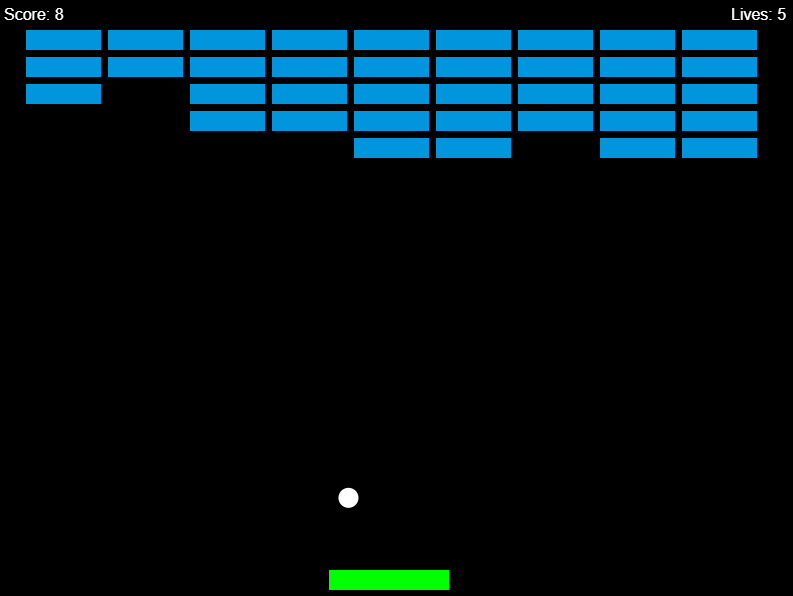

# Ball Paddle Game

## Description
Ball Paddle Game is a browser-based Breakout-style game built with HTML5 and JavaScript. Smash bricks, bounce the ball, and test your skill across multiple difficulties!



## Installation
1. Clone this repository: ```git clone https://github.com/IFLORE24/breakout-game.git```
2. Open index.html in your browser.

## How to Play
* Select a difficulty level.
* Use the paddle to keep the ball from reaching the bottom using **left and right arrow keys** or **A/D keys**
* Break all the bricks to win.
* If you lose all lives, the game ends.
* Press **ESC** to pause the game, allowing you to return to menu or to restart the game.

## Future Improvements
* More precise collision detection
* Addition of power-ups
* Enhanced visuals (i.e particle effects)

## Contribution
Contributions are welcome! If you find a bug, have suggestions for new features, or want to improve the game, feel free to open an issue or submit a pull request.

## License
MIT